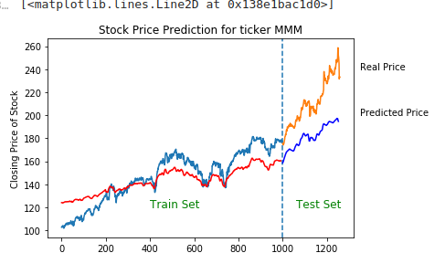

# Machine Learning Mini Project
## RNN Algorithm with GRU Cell 

### Training Details
Use last seven days of numerical values (stock prices), to predict price for the coming next day.

### Prediction
Further price over a future time perid is inferred in an auto-regressive manner.

## DATASET SOURCE
ALL STOCK PRICE DATASET : https://github.com/not4win/MLfinance/blob/master/all_stocks_5yr.csv

From this dataset, we take out stock price for 3M company and train the model.
